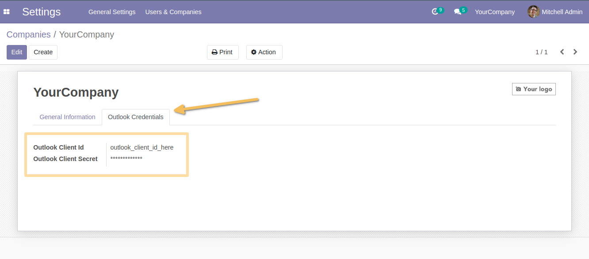
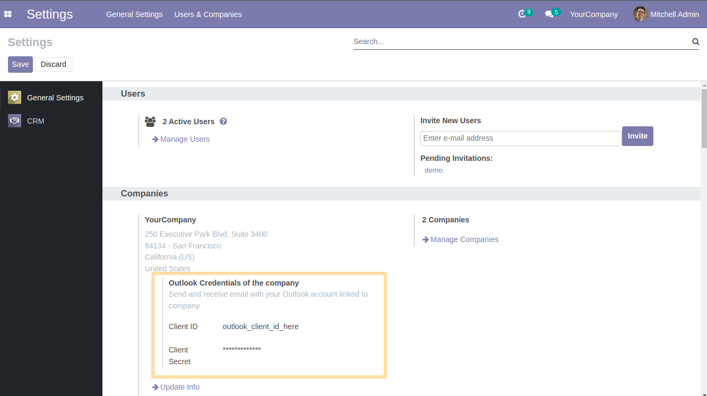
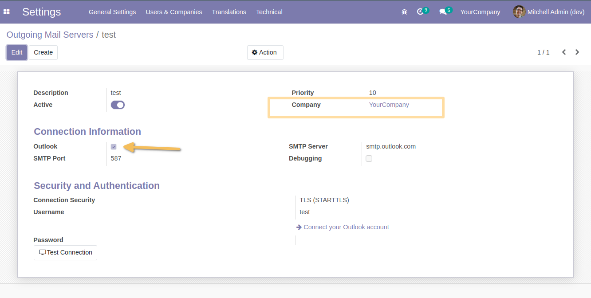

Fetchmail Outlook by company
============================
This module offers the possibility to use Outlook configuration per company, for outgoing mail server/inbound Mail Server.

Dependancy
----------
The module depends on the module `fetchmail_outlook`.

Usage
-----
As an user who can access the form view of a company, I see that there is a `Outlook Credentials` tab.
With the right privilege, I can edit the `Outlook Client Id` and `Outlook Client Secret` field.

As an user who can acces the `General Settings` menu in `Settings`, I can see the information of outlook credentials set to the current company.

When using an outgoing mail server, using the `Outlook` option, and set the company, it will use the outlook credential set on the company.
If the company is not set, it will use the default configuration.

Contributors
------------
* Numigi (tm) and all its contributors (https://bit.ly/numigiens)
