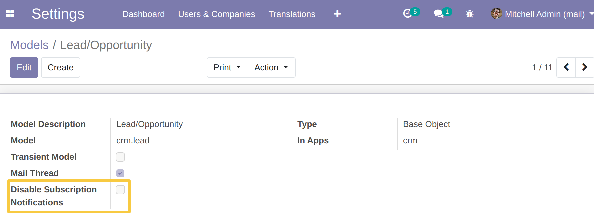

Mail Subscription Notification Management
=========================================

.. contents:: Table of Contents

Overview
--------

The module allows to disable subscription notification for a model.

Settings
--------
As a user belonging to the `Administration / Configuration group`,
activate the developer mode and go to the form view of a model `(Settings > Technical > Database Structure > Models)`.

A new `Disable Subscription Notifications` checkbox is present.

The default value of the box is unchecked.

Usage
-----

If you want to disable the subscription notification for a model, go to the form view of this model, check the box **Disable Subscription Notifications** and save.

    .. image:: static/description/disable_subscription_notification_box_checked.png

Contributors
------------
* Numigi (tm) and all its contributors (https://bit.ly/numigiens)
